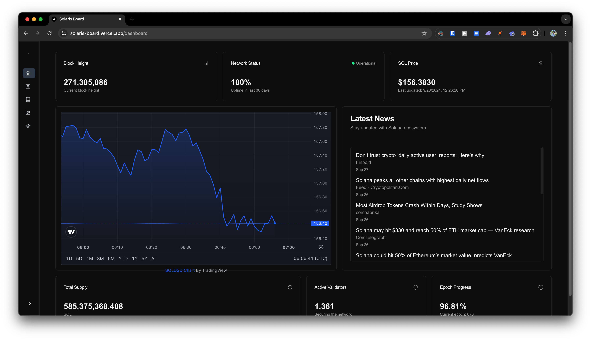
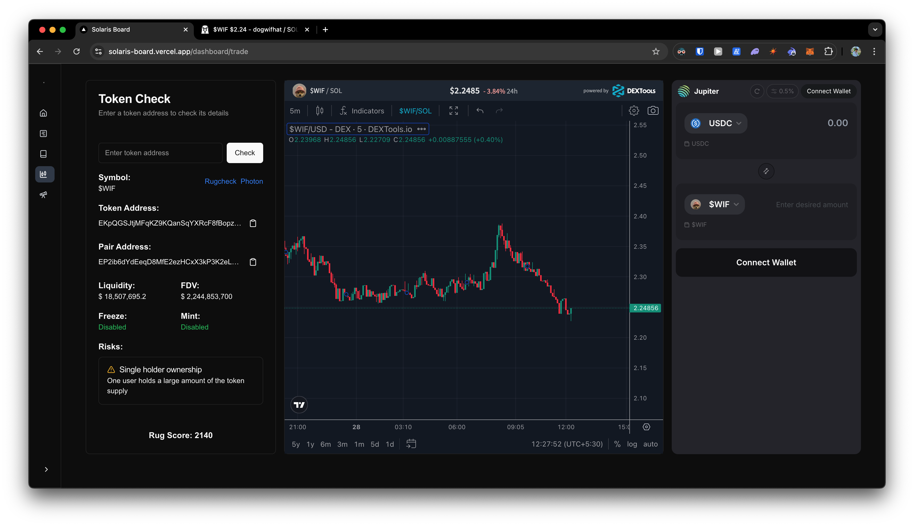
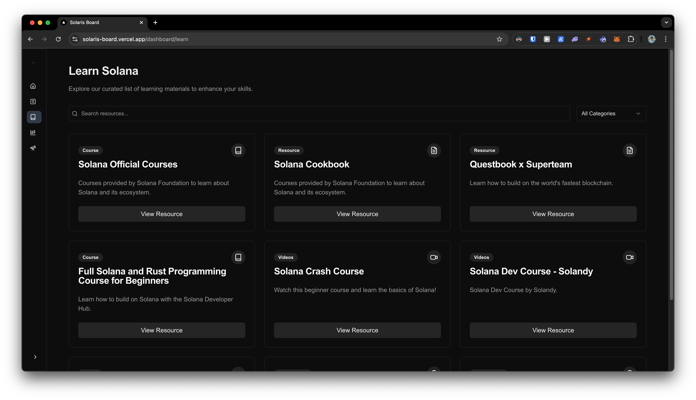
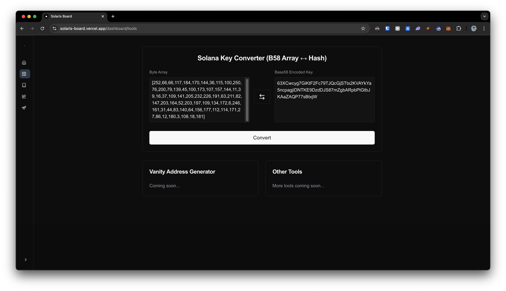

# **Sova Screener**

> [!NOTE]  
> I'll be converting this website to all trade related tools. If you have any good ideas please hit me up on telegram @broken_vortex

A web dashboard built with Next.js and essential Solana ecosystem tools to streamline Solana resources in one place.

It's just a toy dashboard to bring everything related to Solana—like price info, learning resources, tools, and trading—into one place. It’s a convenient hub for all things Solana in one spot!

> [!NOTE]
> The initial loading of dashboard might take a while since mainnet RPC is slow.

## Screenshots

    
## Environment Variables

To run this project, add the following environment variables to your `.env` file.

- `NEXT_PUBLIC_CRYPTO_PANIC_API_KEY`: Your API key for cryptopanic.com news API.
- `NEXT_PUBLIC_RPC_URL`: Solana RPC URL for retrieving the dashboard information.
